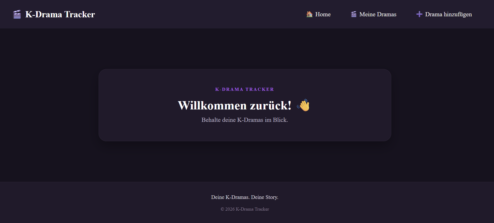
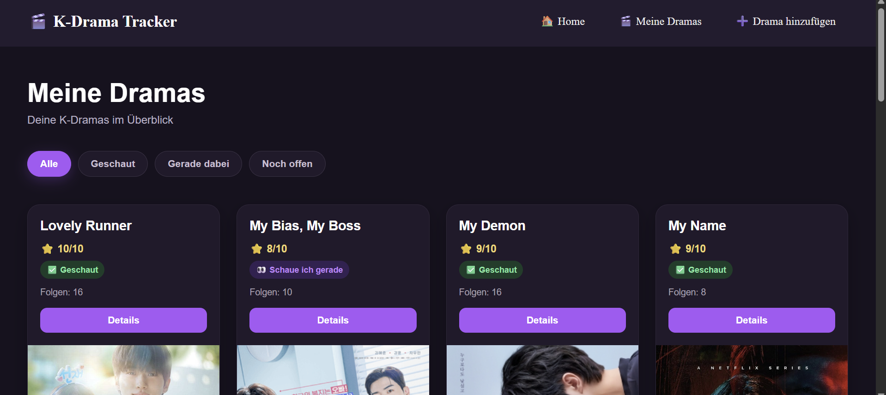
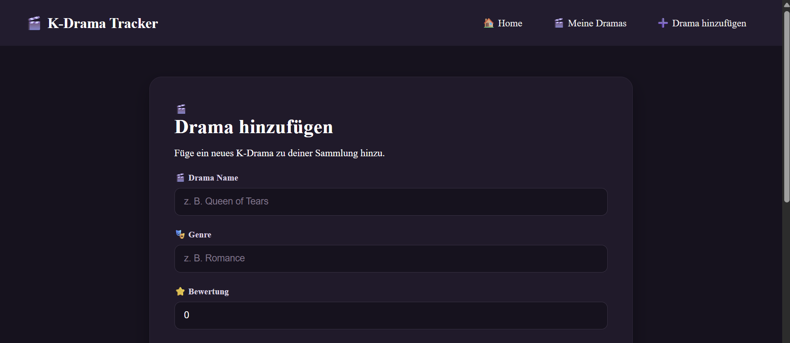
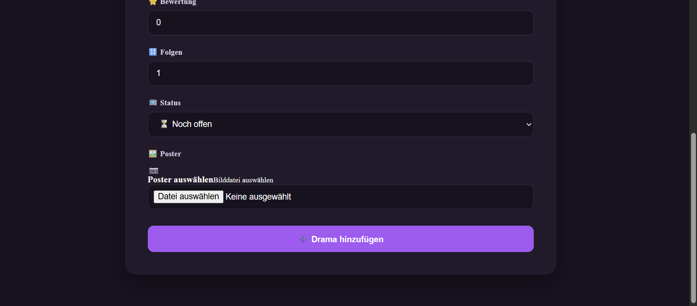
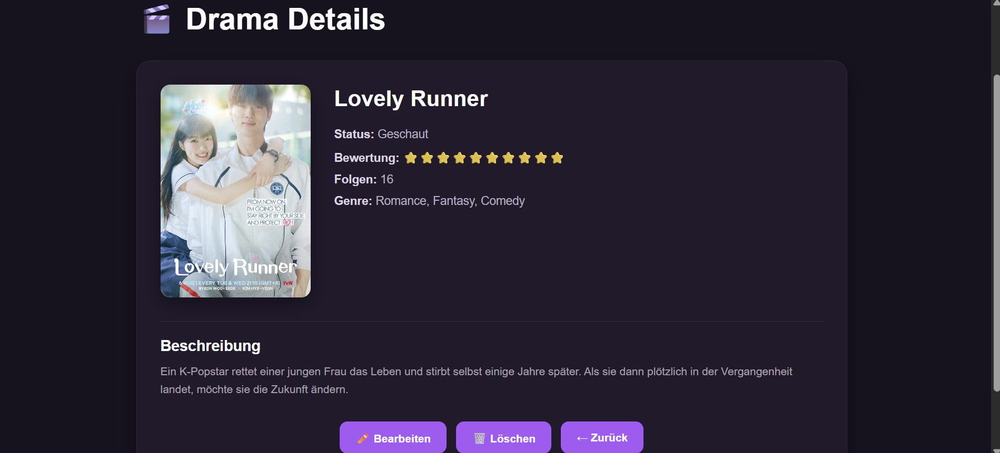

# 🎬 K-Drama Tracker

Mit der Webseite kann ich meine K-Dramas speichern und verwalten.
Ich kann neue Serien hinzufügen, Informationen bearbeiten, Serien löschen und mir die Details anschauen.

---

## 🖥️ Meine Webseite

### 🏠 Startseite



---

### 📺 Meine Dramas

Hier werden meine gespeicherten K-Dramas angezeigt.



---

### ➕ Drama hinzufügen

Hier kann ich ein neues K-Drama mit Name, Genre, Bewertung, Status, Folgen und Poster hinzufügen.




---

### 🔎 Drama Details

Hier sehe ich die Informationen zu einem Drama und das dazugehörige Poster.



---

## ✨ Funktionen

* 🎬 K-Dramas hinzufügen
* 🖼️ Poster hochladen
* 📺 Dramas anzeigen
* 🔎 Details zu einem Drama anzeigen
* ✏️ Dramas bearbeiten
* 🗑️ Dramas löschen
* ⭐ Bewertung speichern
* 🎭 Genre speichern
* 🔢 Folgen speichern
* 📋 Nach Status filtern

---

## 🛠️ Verwendete Technologien

Für mein Projekt benutze ich:

* Angular
* TypeScript
* HTML
* CSS
* Node.js
* Express
* MongoDB

Für den Poster-Upload benutze ich außerdem Multer.

---

## 📁 Projekt

Das Projekt besteht aus einem Angular-Frontend und einem Node.js-Backend.

```text
WebTech2026
│
├── first
│   └── Angular
│
├── HTW
│   └── Semester_2
│       └── WebTech
│           └── backend
│
└── README.md
```

---

## 🚀 Projekt starten

### Frontend

```bash
cd first
ng serve
```

Danach im Browser öffnen:

```text
http://localhost:4200
```

### Backend

```bash
cd HTW/Semester_2/WebTech/backend
node server.js
```

Das Backend läuft auf:

```text
http://localhost:3000
```

---

## 🗄️ Datenbank

Für mein Projekt benutze ich MongoDB.

Die Dramas werden in der Datenbank gespeichert und können über das Backend hinzugefügt, angezeigt, bearbeitet und gelöscht werden.

---

## 🎓 WebTech Projekt

**HTW Berlin – WebTech 2026**

🎬 K-Drama Tracker
💜 Mein Projekt zur Verwaltung meiner K-Dramas


